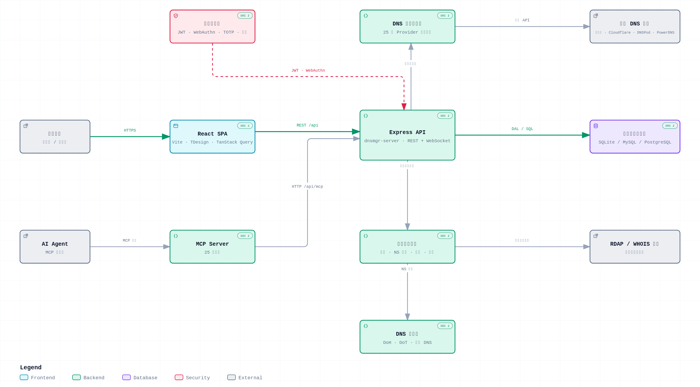

# HiDNS - DNS Aggregation Management Platform

> **原名**: DnsMgr (HiPm DnsMgr) | **现名**: HiDNS (HiPm DNS Aggregation Management Platform)
>
> A modern DNS aggregation management platform built with React + TailwindCSS (frontend) and Node.js + TypeScript (backend).

对于中国用户请看: [简体中文文档](README_zh.md)

## Repository
[](https://github.com/HiPM-Tech/HiDNS/blob/main/LICENSE)
[](https://github.com/HiPM-Tech/HiDNS/releases)

[](https://github.com/HiPM-Tech/HiDNS/issues)\
[](https://github.com/HiPM-Tech/HiDNS/stargazers)
[](https://github.com/HiPM-Tech/HiDNS/forks)\
[](https://github.com/HiPM-Tech/HiDNS/actions/workflows/release.yml)
[](https://github.com/HiPM-Tech/HiDNS/actions/workflows/nightly-build.yml)
[](https://github.com/HiPM-Tech/HiDNS/actions/workflows/test-suite.yml)\
[](https://deepwiki.com/HiPM-Tech/HiDNS)
[![zread](https://img.shields.io/badge/Ask_Zread-_.svg?style=flat-square&color=00b0aa&labelColor=000000&logo=data%3Aimage%2Fsvg%2Bxml%3Bbase64%2CPHN2ZyB3aWR0aD0iMTYiIGhlaWdodD0iMTYiIHZpZXdCb3g9IjAgMCAxNiAxNiIgZmlsbD0ibm9uZSIgeG1sbnM9Imh0dHA6Ly93d3cudzMub3JnLzIwMDAvc3ZnIj4KPHBhdGggZD0iTTQuOTYxNTYgMS42MDAxSDIuMjQxNTZDMS44ODgxIDEuNjAwMSAxLjYwMTU2IDEuODg2NjQgMS42MDE1NiAyLjI0MDFWNC45NjAxQzEuNjAxNTYgNS4zMTM1NiAxLjg4ODEgNS42MDAxIDIuMjQxNTYgNS42MDAxSDQuOTYxNTZDNS4zMTUwMiA1LjYwMDEgNS42MDE1NiA1LjMxMzU2IDUuNjAxNTYgNC45NjAxVjIuMjQwMUM1LjYwMTU2IDEuODg2NjQgNS4zMTUwMiAxLjYwMDEgNC45NjE1NiAxLjYwMDFaIiBmaWxsPSIjZmZmIi8%2BCjxwYXRoIGQ9Ik00Ljk2MTU2IDEwLjM5OTlIMi4yNDE1NkMxLjg4ODEgMTAuMzk5OSAxLjYwMTU2IDEwLjY4NjQgMS42MDE1NiAxMS4wMzk5VjEzLjc1OTlDMS42MDE1NiAxNC4xMTM0IDEuODg4MSAxNC4zOTk5IDIuMjQxNTYgMTQuMzk5OUg0Ljk2MTU2QzUuMzE1MDIgMTQuMzk5OSA1LjYwMTU2IDE0LjExMzQgNS42MDE1NiAxMy43NTk5VjExLjAzOTlDNS42MDE1NiAxMC42ODY0IDUuMzE1MDIgMTAuMzk5OSA0Ljk2MTU2IDEwLjM5OTlaIiBmaWxsPSIjZmZmIi8%2BCjxwYXRoIGQ9Ik0xMy43NTg0IDEuNjAwMUgxMS4wMzg0QzEwLjY4NSAxLjYwMDEgMTAuMzk4NCAxLjg4NjY0IDEwLjM5ODQgMi4yNDAxVjQuOTYwMUMxMC4zOTg0IDUuMzEzNTYgMTAuNjg1IDUuNjAwMSAxMS4wMzg0IDUuNjAwMUgxMy43NTg0QzE0LjExMTkgNS42MDAxIDE0LjM5ODQgNS4zMTM1NiAxNC4zOTg0IDQuOTYwMVYyLjI0MDFDMTQuMzk4NCAxLjg4NjY0IDE0LjExMTkgMS42MDAxIDEzLjc1ODQgMS42MDAxWiIgZmlsbD0iI2ZmZiIvPgo8cGF0aCBkPSJNNCAxMkwxMiA0TDQgMTJaIiBmaWxsPSIjZmZmIi8%2BCjxwYXRoIGQ9Ik00IDEyTDEyIDQiIHN0cm9rZT0iI2ZmZiIgc3Ryb2tlLXdpZHRoPSIxLjUiIHN0cm9rZS1saW5lY2FwPSJyb3VuZCIvPgo8L3N2Zz4K&logoColor=ffffff)](https://zread.ai/HiPM-Tech/HiDNS)

## Features

- **Multi-provider Support**: Manage DNS records across 22+ providers:
  - **Domestic (China)**: Aliyun (阿里云), DNSPod (腾讯云), Huawei Cloud (华为云), Baidu Cloud (百度云)
    Volcengine (火山引擎), JD Cloud (京东云), West Digital (西部数码), Qingcloud (青云)
    BT Panel (宝塔), Aliyun ESA (阿里云 ESA), Tencent EdgeOne (腾讯 EdgeOne), Rainyun (雨云), VPS8
  - **International**: Cloudflare, NameSilo, Spaceship, PowerDNS, DNS.LA, DNSHE, HiDNS, CaihongDNS (彩虹DNS聚合), Gcore

- **Advanced Features**:
  - WHOIS query with intelligent caching (registrar mode support)
  - Domain renewal management (automated renewal scheduling)
  - NS monitoring and failover (high availability保障)
  - API Token management (fine-grained permission control)
  - Cloudflare Tunnel integration
  - Multi-language support (Chinese/English/Japanese/Spanish)
  - OAuth2/OIDC single sign-on
  - WebAuthn/Passkeys passwordless login
  - TOTP two-factor authentication
  - Complete audit logging system
  - Security policies and login restrictions
  - Email notification and template management

- **Multi-user & Team Management**: Role-based access (admin/member), team-based domain sharing
- **Full DNS Record Management**: CRUD for all record types (A, AAAA, CNAME, MX, TXT, SRV, CAA, etc.)
- **Modern UI**: React 18 + TailwindCSS with responsive design
- **API Documentation**: Swagger UI at `/api/docs`
- **Extensible Architecture**: Abstract DNS interface makes adding new providers easy

## Provider Type & Alias Mapping

When creating/updating DNS accounts, the API normalizes lego-style provider names to internal provider types.

| Internal Type | Supported Aliases |
|---|---|
| `aliyun` | `aliyun`, `alidns` |
| `aliyunesa` | `aliesa` |
| `baidu` | `baiducloud` |
| `huawei` | `huaweicloud` |
| `huoshan` | `huoshan`, `volcengine` |
| `west` | `westcn` |
| `cloudflare` | `cloudflare` |
| `jdcloud` | `jdcloud` |
| `namesilo` | `namesilo` |
| `rainyun` | `rainyun` |
| `powerdns` | `powerdns`, `pdns` |
| `dnspod` | `dnspod`, `tencentcloud` |
| `tencenteo` | `tencenteo`, `edgeone` |
| `dnsla` | `dnsla` |
| `bt` | `bt` |
| `qingcloud` | `qingcloud` |
| `spaceship` | `spaceship` |
| `dnshe` | `dnshe` |
| `HiDNS` | `HiDNS` |
| `caihongdns` | `caihongdns` |
| `vps8` | `vps8` |
| `gcore` | `gcore` |

## Architecture

### Architecture Overview

<picture>
  <source media="(prefers-color-scheme: dark)" srcset="docs/architecture/hidns-architecture-dark.png">
  
</picture>

> **Interactive version** — pan/zoom, search, focus tracing, light/dark themes, presentation mode and PNG/SVG export:
> [`docs/architecture/hidns-architecture.html`](docs/architecture/hidns-architecture.html) (download and open it in a browser).

### System Architecture

```
HiDNS/
├── server/          # Node.js + TypeScript backend
│   └── src/
│       ├── lib/dns/ # DNS provider adapters (abstract interface)
│       ├── routes/  # REST API routes
│       ├── middleware/ # Auth (JWT), validation
│       ├── service/ # Business logic services
│       │   ├── whoisService.ts      # WHOIS query service
│       │   ├── whoisScheduler.ts    # WHOIS scheduler
│       │   ├── renewalScheduler.ts  # Domain renewal scheduler
│       │   ├── nsMonitorJob.ts      # NS monitoring task
│       │   ├── failover.ts          # Failover service
│       │   ├── taskManager.ts       # Task manager
│       │   ├── notification.ts      # Notification service
│       │   ├── audit.ts             # Audit service
│       │   ├── token.ts             # API Token service
│       │   └── session.ts           # Session management
│       └── db/      # Three-layer database architecture
│           ├── business-adapter.ts  # Business adapter layer (functional API)
│           ├── core/                # Database abstraction layer
│           ├── drivers/             # Database drivers (MySQL/PostgreSQL/SQLite)
│           └── schemas/             # Database schemas
└── client/          # React + Vite + TailwindCSS frontend
    └── src/
        ├── pages/   # All UI pages
        │   ├── NSMonitor.tsx        # NS monitoring page
        │   ├── Tokens.tsx           # API Token management
        │   ├── Tunnels.tsx          # Tunnel management
        │   ├── Security.tsx         # Security settings
        │   └── OAuthCallback.tsx    # OAuth callback
        ├── components/ # Reusable components
        └── api/     # API client
```

### Database Architecture (Multi-Layer Design)

HiDNS implements a strict multi-layer database architecture:

```
Routes/Service Layer → Business Adapter Layer(BAL) → Core Layer(DAC) → Driver Layer(DL) → Database
                                        ↕
                           Declarative Schema Management(DSM)
```

**Layer 1: Business Adapter Layer** (`server/src/db/bal/`)
- Functional API: `query()`, `get()`, `execute()`, `insert()`, `run()`
- Business operation modules: `UserOperations`, `DnsAccountOperations`, etc. (24+ modules)
- All database operations MUST go through this layer
- Automatic logging and performance monitoring

**Layer 2: Database Abstraction Layer** (`server/src/db/core/`)
- Unified type definitions
- Connection manager (singleton pattern)
- Database configuration management
- Query builder & SQL compiler

**Layer 3: Driver Layer** (`server/src/db/dl/`)
- MySQL driver (connection pool)
- PostgreSQL driver (connection pool)
- SQLite driver (better-sqlite3)
- Common SQL compilation logic unified in `BaseDriver` base class

**Layer 4: Declarative Schema Management** (`server/src/db/dsm/`)
- Declarative Schema definitions (`complete-schema.ts`)
- Schema reconciler (auto-detect and sync table structure differences)
- Data migration runner (legacy system upgrades)
- Version management

### Database API Usage

```typescript
// ✅ Correct - Use business adapter functions
import { query, get, execute, insert, UserOperations } from '../db';

const user = await get<User>('SELECT * FROM users WHERE id = ?', [userId]);
const users = await query<User>('SELECT * FROM users WHERE status = ?', ['active']);
const id = await insert('INSERT INTO users (name, email) VALUES (?, ?)', [name, email]);

// Use business operation modules
const user = await UserOperations.getById(1);
```

See [ARCHITECTURE.md](ARCHITECTURE.md) for detailed architecture documentation.

## Quick Start

### Prerequisites
- Node.js >= 18
- pnpm

### Install Dependencies

```bash
pnpm install
```

### Development

#### Mode 1: Concurrent Start (Recommended for most users)

Start both frontend and backend with a single command (runs on separate ports):

```bash
# Start both server (port 3001) and client (port 5173) in parallel
pnpm dev
```

Access: http://localhost:5173

> First startup note: if the system is not initialized yet, open the setup wizard at `http://localhost:5173/setup` (or `http://localhost:3001/setup` in unified mode) to configure DB and create the first admin.

#### Mode 2: Separate Start (For advanced users)

Start frontend and backend independently in separate terminals:

```bash
# Terminal 1 - Backend only (port 3001)
cd server && pnpm dev

# Terminal 2 - Frontend only (port 5173)
cd client && pnpm dev
```

### Production Build

```bash
pnpm build
```

### Source Code - Unified Mode (Single Port)

Run both frontend and backend on the same port (3001) - backend serves static files:

```bash
# Step 1: Build frontend first
pnpm --filter client build

# Step 2: Start backend only (serves both API and frontend on port 3001)
cd server && pnpm dev
```

Access: http://localhost:3001

This mode is useful when you want:
- Only one port exposed
- Same behavior as Docker deployment
- Simpler reverse proxy configuration

### Docker Deployment

Docker deployment uses all-in-one mode (frontend + backend in single container).

#### Option 1: Use Pre-built Image (Recommended)

```bash
# Run with pre-built image from GitHub Container Registry
docker run -d \
  -p 3001:3001 \
  -v $(pwd)/data:/app/data \
  --name hidns \
  ghcr.io/hipm-tech/hidns:latest
```

Or use Docker Compose:

```bash
# Download compose file
curl -O https://raw.githubusercontent.com/HiPM-Tech/HiDNS/main/docker-compose.yml

# Start service
docker-compose up -d
```

#### Option 2: Build from Source

```bash
# Build and run
docker build -t hidns .
docker run -d \
  -p 3001:3001 \
  -v $(pwd)/data:/app/data \
  --name hidns \
  hidns
```

Access: http://localhost:3001

### Environment Variables

Copy `.env.example` to `.env` in the `server/` directory:

```bash
cp server/.env.example server/.env
```

| Variable | Default | Description |
|----------|---------|-------------|
| `PORT` | `3001` | Server port |
| `NODE_ENV` | `development` | Runtime environment |
| `JWT_SECRET` | unset | Base JWT secret; if unset, server falls back to an insecure default (set this in production) |
| `DB_PATH` | `./HiDNS.db` | SQLite database path |
| `DB_TYPE` | `sqlite` | Database type: `sqlite`, `mysql`, or `postgresql` |
| `DB_HOST` | - | Database host (for MySQL/PostgreSQL) |
| `DB_PORT` | - | Database port (for MySQL/PostgreSQL) |
| `DB_NAME` | - | Database name (for MySQL/PostgreSQL) |
| `DB_USER` | - | Database user (for MySQL/PostgreSQL) |
| `DB_PASSWORD` | - | Database password (for MySQL/PostgreSQL) |
| `DB_SSL` | `false` | Enable SSL for MySQL/PostgreSQL |

### JWT runtime secret rotation (important)

- JWT signing uses: `JWT_SECRET + runtime_secret` (from DB table `runtime_secrets`).
- A per-runtime secret is generated/stored automatically if missing.
- During setup, after creating the first admin, runtime secrets are rotated.
- Existing JWT tokens become invalid when runtime secret changes.

## Initialization & Security Notes

- `/api/init/*` endpoints are intended for pre-setup initialization.
- Once the system is initialized (DB ready + users exist), `/api/init/database` rejects re-initialization with `403`.
- Admin credentials are created by setup wizard/API (`/api/init/admin`), not by a fixed default account.

## API Documentation

After starting the server, visit: `http://localhost:3001/api/docs`

## Record Model Notes

- DNS records still expose the generic `line` field for backward compatibility.
- For Cloudflare, use provider-specific fields in request/response payloads:
  - `cloudflare.proxied`: proxy switch (`true` = proxied, `false` = DNS only)
  - `cloudflare.proxiable`: whether the current record type can be proxied
- Write precedence for Cloudflare create/update:
  - If `cloudflare.proxied` is provided, it is used.
  - Otherwise, fallback to `line` (`'1'` = proxied, `'0'` = DNS only).

## Adding a New DNS Provider

1. Create a new adapter in `server/src/lib/dns/providers/myprovider.ts` implementing `DnsAdapter`
2. Register it in `server/src/lib/dns/DnsHelper.ts` (add to `DNS_PROVIDERS` map)
3. Export it in `server/src/lib/dns/providers/index.ts`

The adapter must implement the `DnsAdapter` interface:

```typescript
interface DnsAdapter {
  check(): Promise<boolean>;
  getDomainList(...): Promise<PageResult<DomainInfo>>;
  getDomainRecords(...): Promise<PageResult<DnsRecord>>;
  addDomainRecord(...): Promise<string | null>;
  updateDomainRecord(...): Promise<boolean>;
  deleteDomainRecord(...): Promise<boolean>;
  setDomainRecordStatus(...): Promise<boolean>;
  // ...
}
```

## Tech Stack

**Backend:**
- Node.js + TypeScript
- Express.js
- SQLite (better-sqlite3), MySQL (mysql2), PostgreSQL (pg)
- JWT authentication
- Swagger/OpenAPI documentation
- node-cron / node-schedule: Task scheduling
- nodemailer: Email sending
- @simplewebauthn/server: WebAuthn support
- speakeasy: TOTP generation and verification
- axios: HTTP client

**Frontend:**
- React 18 + TypeScript
- Vite
- TailwindCSS v3
- React Router v6
- @tanstack/react-query
- Axios
- lucide-react
- react-hook-form: Form management
- zod: Data validation
- date-fns: Date handling
- clsx / tailwind-merge: CSS class merging

## License

MIT


## Internationalization (i18n) & Contribution

HiDNS uses `react-i18next` for internationalization. The current supported languages are English, Simplified Chinese, Spanish, and Japanese.

We welcome community contributions for new languages! Here's how to add one:

1. Copy an existing language file (e.g., `client/src/i18n/locales/en.ts`) to a new file like `fr.ts` (for French).
2. Translate the string values in your new file.
3. Import and add your new language to the `resources` object in `client/src/i18n/index.ts`.
4. Update the language selector in `client/src/pages/Settings.tsx` to include your new language option.

**Tip:** We recommend using the [i18n-ally](https://marketplace.visualstudio.com/items?itemName=Lokalise.i18n-ally) VS Code extension. The project already includes the `.vscode/settings.json` configuration for it, which helps you easily find missing translations and manage keys.

## Adding New DNS Providers

We support multiple DNS providers out of the box (Cloudflare, AliYun, TencentCloud, HuaweiCloud, DNSPod, GoDaddy). If your provider is not supported, you can easily add it:

1. **Implement the Adapter**: Create a new file in `server/src/lib/dns/providers/` implementing the `DnsAdapter` interface.
2. **Register the Adapter**: Add your adapter to the switch case in `server/src/lib/dns/DnsHelper.ts`.
3. **Update Frontend**: Add your provider to the `PROVIDERS` list in `client/src/pages/Accounts.tsx` with its required configuration fields.
4. **Submit a PR**: We welcome pull requests! Ensure your code follows the existing style and passes the tests.

---

## 🛡️ AI Censorship & Code Quality

HiDNS adopts a strict AI code review mechanism to ensure code quality and project standards.

### Code Review Standards

- **P0 Level** (Must Fix): Database standards, security vulnerabilities, functional defects
- **P1 Level** (Recommended Fix): Code quality, performance optimization, i18n completeness
- **P2 Level** (Optional Optimization): Code comments, naming conventions, abstraction reuse

### Core Requirements

1. ✅ All database operations MUST go through the Business Adapter Layer
2. ✅ JWT authentication uses dual-key structure
3. ✅ Complete logging (requests, responses, errors, business operations)
4. ✅ OAuth2/OIDC standard support
5. ✅ Complete i18n multi-language support

### Documentation

- [Development Standards](docs/DEVELOPMENT.md) - Code standards, database standards, development process
- [AI Censorship](ai-censorship/root.md) - Code review standards and checklist
- [Architecture Documentation](docs/architecture/overview.md) - System architecture design
- [API Documentation](docs/api-reference.md) - Complete RESTful API reference

## Star History

<a href="https://www.star-history.com/?repos=HiPM-Tech%2FHiDNS&type=date&legend=top-left">
 <picture>
   <source media="(prefers-color-scheme: dark)" srcset="https://api.star-history.com/chart?repos=HiPM-Tech/HiDNS&type=date&theme=dark&legend=top-left" />
   <source media="(prefers-color-scheme: light)" srcset="https://api.star-history.com/chart?repos=HiPM-Tech/HiDNS&type=date&legend=top-left" />
   
 </picture>
</a>

## Community & Support

- **GitHub Repository**: https://github.com/HiPM-Tech/DNSMgr
- **Telegram Group**: https://t.me/HiDNSManager
- **License**: GPL-3.0

## ☕ Sponsor

If you find HiDNS helpful, consider buying me a coffee! Your support keeps the project alive and motivated.

<p align="center">
  
  
</p>

<p align="center">
  <i>Reward Code &nbsp;&nbsp;&nbsp;&nbsp;&nbsp;&nbsp;&nbsp;&nbsp;&nbsp;&nbsp;&nbsp;&nbsp;&nbsp; Donation Code</i>
</p>

---

<p align="center">
  Made with ❤️ by HiPM Tech
</p>
